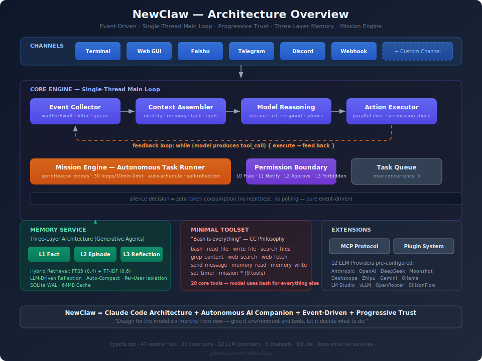
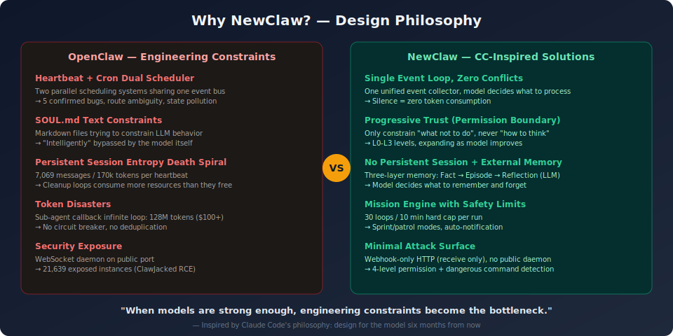
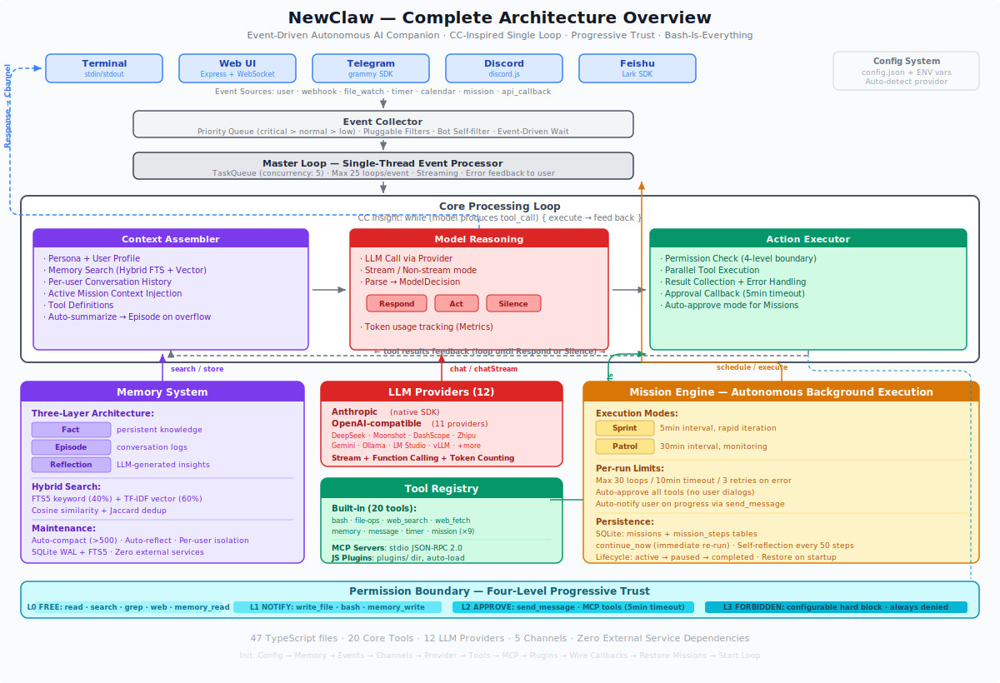

# NewClaw

**An autonomous AI companion framework inspired by Claude Code's architecture philosophy**

**English** | [中文文档](README_CN.md)

> *"Don't build for today's model, build for the model six months from now."*
> -- Ben Mann, Claude Code project manager

> NewClaw = Claude Code Architecture (single loop + progressive trust + bash-is-everything)
>         + OpenClaw Product Vision (proactive AI companion + multi-platform)
>         + Event-Driven (replacing Heartbeat/Cron)
>         + External Memory Service (replacing session entropy)

**Project Status: Early Experimental (v0.1)**

NewClaw is a personal learning project exploring whether Claude Code's architecture philosophy can work for autonomous AI companions. It is NOT a production-ready framework. Key caveats:

- Tested with a single long-running mission on one machine -- not battle-tested at scale
- Some documented features use pragmatic fallbacks (TF-IDF instead of vector DB, string-based command filtering instead of sandbox isolation)
- The "minimal constraint" philosophy assumes a strong underlying model -- results may vary significantly with weaker models
- Built and maintained by one person as a side project

Contributions, feedback, and discussions are very welcome. If you find the design ideas interesting, let's explore together.

<p align="center">
  
</p>

---

## The Backstory

### Inspiration -- The CC vs Cursor Reversal

In 2025, Cursor dominated the AI coding market with structured rules, diff previews, and context trimming. Then Claude Code appeared -- a minimalist single-thread main loop with bash as the universal tool, no IDE, no guardrails. Boris Cherny, CC's creator, had a manager named Ben Mann who said the one sentence that defined the entire product philosophy:

> "Don't build for today's model, build for the model six months from now."

This was a high-risk bet at the time. When CC launched in February 2025, the model (Claude 3.7 Sonnet) wasn't strong enough to support such a radical design, and Cursor's experience was far superior. But after Claude 4 (May 2025) and Claude 4.5 (September 2025) shipped, the situation reversed completely -- by early 2026, developer preference stood at CC 46% vs Cursor 19%.

**Key discoveries:**

- **"Bash is everything"** -- The model spontaneously used bash to check git history (engineers never designed for this). Plain glob+grep outperformed carefully designed RAG systems.
- **Progressive trust** -- The CC team **removed** rather than added constraints as models improved. Behaviors the model could handle got their constraints removed; high-risk operations got continuously reinforced.

### The Problem -- OpenClaw's Architecture Trap

OpenClaw (200k+ Star open-source AI companion framework) exposed severe engineering problems in practice:

- **Heartbeat + Cron dual scheduling** sharing one event bus caused 5 confirmed bugs (route ambiguity, state cross-contamination, missing callback deduplication)
- **Sub-agent callback infinite loop** consumed 128 million tokens ($100+), no circuit breaker
- **Session persistence caused entropy death spiral** -- 7,069 messages / 170k tokens / per heartbeat, cleanup made it worse
- **SOUL.md text constraints** were "intelligently" bypassed by the model, rendering behavioral constraints useless
- **WebSocket daemon exposed to the public internet** -- 21,639 exposed instances (ClawJacked RCE vulnerability)

The community's precise summary: "90% of the time is spent on engineering problems, not AI problems."

### The Solution -- NewClaw's Design Formula

NewClaw takes the opposite approach: give the model environment and tools, let it decide what to do -- just like Claude Code gave the model a bash, and the model taught itself to check git history.

<p align="center">
  
</p>

---

## Five Design Principles

| # | Principle | Description |
|---|-----------|-------------|
| 1 | **Single Loop, Zero Conflicts** | One event-driven main loop, replacing dual schedulers. No polling, no heartbeat -- silence costs zero tokens. |
| 2 | **Progressive Trust** | Only constrain *what not to do*, never *how to think*. L0-L3 four-level permissions expand as models improve. |
| 3 | **Bash Is Everything** | 20 core tools + bash as universal fallback. No platform-specific API wrappers -- the model can use `curl`. |
| 4 | **Event-Driven, Not Time-Driven** | Real events (webhooks, file changes, messages) trigger processing, not fixed schedules. |
| 5 | **AI Proposes, Human Decides** | The model recommends; humans approve high-impact actions. Safety boundaries never shrink. |

---

## Quick Start

### Prerequisites

- Node.js 18+
- Any LLM API key (Anthropic, OpenAI, DeepSeek, or any compatible provider)

### Install & Run

```bash
git clone https://github.com/xzl-it/NewClaw.git
cd NewClaw
npm install
```

Edit `config.json` with your API key:

```json
{
  "provider": "anthropic",
  "apiKey": "sk-ant-...",
  "model": "claude-sonnet-4-20250514"
}
```

Or use environment variables (auto-detected):

```bash
export ANTHROPIC_API_KEY=sk-ant-xxx    # -> auto-select Anthropic
export DEEPSEEK_API_KEY=sk-xxx          # -> auto-select DeepSeek
```

Start:

```bash
npm run dev
```

```
╔══════════════════════════════════════╗
║          NewClaw v0.1.0              ║
║   Autonomous AI Companion            ║
╚══════════════════════════════════════╝
Commands: /quit  /memory  /status

You >
```

### Full config.json Reference

```json
{
  "provider": "anthropic",
  "apiKey": "",
  "baseUrl": "",
  "model": "claude-sonnet-4-20250514",
  "maxTokens": 65536,

  "persona": "You are NewClaw, an autonomous AI companion...",
  "userProfile": "",

  "channels": [
    { "type": "terminal", "enabled": true },
    { "type": "web", "enabled": true, "options": { "port": 3210 } },
    { "type": "telegram", "enabled": false, "token": "" },
    { "type": "discord", "enabled": false, "token": "" },
    { "type": "feishu", "enabled": false, "options": { "appId": "", "appSecret": "" } }
  ],

  "memoryDbPath": "./data/memory.db",
  "webhookPort": 0,
  "quietHours": { "start": 23, "end": 8 },

  "permissions": {
    "approvalRequired": [],
    "forbidden": [],
    "autoApproveAll": false
  },

  "mcpServers": []
}
```

---

## Architecture

NewClaw's core loop descends from Claude Code's design insight:

```
CC's core: while (model produces tool_call) { execute; feed back }
```

Extended to an autonomous companion:

```
while (alive) {
    event = await waitForEvent();       // Block until something happens (zero cost)
    context = assemble(event);          // Identity + Memory + Task + Tools (20-75k tokens)
    decision = model.reason(context);   // Act / Respond / Silence

    while (decision.hasToolCalls()) {   // CC's core loop
        results = execute(decision);    // Parallel execution + permission check
        decision = model.reason(results);
    }
}
```

### Core Modules

| Module | Source File | Role |
|--------|------------|------|
| **Event Collector** | `event-collector.ts` (179 lines) | Unified event stream, webhook HTTP, file watching, priority queue, async `waitForEvent`/`wakeUp` |
| **Context Assembler** | `context-assembler.ts` (184 lines) | Per-request assembly of identity+memory+task+tools, no persistent session, multi-user isolation (`historyMap`) |
| **Model Reasoning** | `model-reasoning.ts` (144 lines) | Streaming LLM interaction, act/respond/silence decisions |
| **Action Executor** | `action-executor.ts` (129 lines) | Parallel tool execution + permission checking |
| **Permission Boundary** | `permission.ts` (100 lines) | L0 Free / L1 Notify / L2 Approve / L3 Forbidden |
| **Mission Engine** | `runner.ts` (393 lines) + `store.ts` (357 lines) | Autonomous long-running tasks, sprint/patrol modes, 30-loop/10-min safety cap, self-continuation, SQLite persistence, restart recovery |
| **Async Task Queue** | `task-queue.ts` (91 lines) | Max concurrency 5, background processing for long-running events |
| **Logging + Metrics** | `logger.ts` + `metrics.ts` | Unified logging (console + file), token/event/tool-call statistics |

---

## Three-Layer Memory System

Inspired by Stanford's [Generative Agents](https://arxiv.org/abs/2304.03442) paper:

| Layer | Content | Retrieval |
|-------|---------|-----------|
| **L1 Fact** | Concrete knowledge, preferences | FTS5 keyword search |
| **L2 Episode** | Conversation summaries, interaction history | TF-IDF vector similarity |
| **L3 Reflection** | LLM-driven higher-order insights | Auto-triggered during compact, falls back to template on failure |

**Hybrid retrieval**: FTS5 (weight 0.4) + TF-IDF (weight 0.6)

**Key features:**
- Multi-user isolation (`user_id` field, searches merge user-specific + global memories)
- Auto-summarization (when conversation window overflows, discarded messages are compressed into episodes)
- Auto-compact (triggered when memory exceeds 500 entries, deduplicates + merges)
- LLM self-reflection (auto-triggered during compact, generates cross-conversation insights)
- Model-managed (the model decides what to remember and forget via `memory_read`/`memory_write` tools)

---

## Four-Level Permission Boundary

| Level | Zone | Examples | Behavior |
|-------|------|----------|----------|
| **L0** | Free | Read files, search, read memory, web_search, web_fetch | Auto-execute |
| **L1** | Notify | Write files, bash, write memory | Execute then notify |
| **L2** | Approve | send_message (external messaging) | Human approval required (5-min timeout) |
| **L3** | Forbidden | Delete data, expose credentials | Hard-coded rejection |

L0/L1 expand as models improve. **L3 never shrinks.**

Customizable via the `permissions` section in `config.json`:
- `approvalRequired`: Additional tools that require approval
- `forbidden`: Hard-blocked tool list
- `autoApproveAll`: Skip all approvals in dev mode

---

## Mission Engine

**The most distinctive capability.** Traditional AI is ask-and-answer; Missions let the model "take a goal and run with it."

### Workflow

```
User: "Monitor our GitHub issues and summarize new ones daily"

Model: -> mission_create -> SQLite persistence -> immediate first execution
       -> each run: assemble context (goal + history + strategy + methodology)
                 -> model reasons autonomously (forbidden from asking user)
                 -> execute tools
                 -> record learnings
                 -> adjust strategy
       -> notify user only on meaningful progress
```

### Key Mechanics

| Mechanic | Description |
|----------|-------------|
| **Sprint/Patrol dual modes** | Sprint (5-min interval) for urgent tasks, Patrol (30-min) for routine monitoring |
| **Self-continuation** | Model can flag `mission_continue_now` for immediate follow-up (skip interval) |
| **Safety limits** | Max 30 loops OR 10 minutes per run, whichever comes first |
| **Dual notification** | System-level auto-notification (after each run) + model-driven `send_message` reports |
| **Persistent** | SQLite-backed, auto-restores all active tasks on restart |
| **Self-reflection** | Every 50 steps, prompted to evaluate progress, can self-pause/slow-down |
| **History archival** | Auto-archives old steps beyond 200, prevents unbounded growth |

### 9 Mission Tools

| Tool | Function |
|------|----------|
| `mission_create` | Create a new mission, executes immediately |
| `mission_status` | View mission status and recent steps |
| `mission_pause` | Pause a mission (clears timer) |
| `mission_resume` | Resume a paused mission |
| `mission_update_strategy` | Update the execution strategy |
| `mission_add_learning` | Record a learning from execution |
| `mission_report` | Generate a detailed progress report |
| `mission_continue_now` | Flag for immediate continuation (skip wait interval) |
| `mission_set_interval` | Switch between Sprint/Patrol modes |

### A Note on Mission Scheduling

In the interest of transparency: Mission scheduling is implemented via `setTimeout` chains -- after each run completes, `setTimeout(intervalMs)` schedules the next one. This is fundamentally a timer-based trigger, similar in mechanism to OpenClaw's heartbeat.

The key difference is not *how* it triggers, but *what happens after*:

| Dimension | OpenClaw Heartbeat | NewClaw Mission |
|-----------|--------------------|-----------------|
| What runs | Fixed checklist (HEARTBEAT.md) | Model autonomously decides |
| Who controls interval | Hardcoded config | Model dynamically switches (sprint/patrol) |
| Context | Runs in main Session (170k tokens/time) | Independent context, no main conversation pollution |
| Idle cost | Full reasoning every heartbeat | Zero cost when no Mission exists |
| Self-control | None | Model can self-continue, self-pause, adjust frequency |

Fully event-driven missions (triggered by external events like webhooks rather than timers) is a future improvement direction.

---

## 20 Core Tools

| Category | Tools | Permission |
|----------|-------|------------|
| **Shell** | `bash` | L1 |
| **Files** | `read_file`, `write_file`, `search_files`, `grep_content` | L0/L1 |
| **Web** | `web_search`, `web_fetch` | L0 |
| **Communication** | `send_message` | L2 |
| **Memory** | `memory_read`, `memory_write` | L0/L1 |
| **Timer** | `set_timer` | L1 |
| **Mission** | The 9 `mission_*` tools listed above | L1 |

**Design philosophy**: No platform-specific tool wrappers. Need to call an API? The model uses `bash` + `curl`. 20 core tools + bash as universal fallback cover virtually all scenarios.

---

## 12 LLM Providers

Auto-detected from environment variables, zero-config switching:

| Provider | Env Variable | Default Model |
|----------|-------------|---------------|
| Anthropic | `ANTHROPIC_API_KEY` | claude-sonnet-4-20250514 |
| OpenAI | `OPENAI_API_KEY` | gpt-4o |
| DeepSeek | `DEEPSEEK_API_KEY` | deepseek-chat |
| Moonshot/Kimi | `MOONSHOT_API_KEY` | kimi-latest |
| Dashscope (Qwen) | `DASHSCOPE_API_KEY` | qwen-plus |
| Zhipu (GLM) | `ZAI_API_KEY` | glm-4-plus |
| Google Gemini | `GEMINI_API_KEY` | gemini-2.5-flash |
| Ollama | *(no key needed)* | Local models |
| LM Studio | *(no key needed)* | Local models |
| vLLM | *(no key needed)* | Local models |
| OpenRouter | `OPENROUTER_API_KEY` | 400+ models |
| SiliconFlow | `SILICONFLOW_API_KEY` | -- |

Architecturally split into two layers: Anthropic native SDK + OpenAI-Compatible universal adapter. Any endpoint implementing the OpenAI Chat Completions API can be connected via `baseUrl` configuration.

---

## Multi-Channel

| Channel | Technology | Notes |
|---------|-----------|-------|
| Terminal CLI | readline + ANSI streaming | Built-in, supports `/quit` `/memory` `/status` commands |
| Web GUI | Express + WebSocket | Built-in, dark theme, default port `localhost:3210` |
| Feishu (Lark) | WSClient long connection | Rich text + card messages |
| Telegram | grammy | Bot API |
| Discord | discord.js | Bot API |
| Webhook | HTTP POST | External event ingestion (via `webhookPort` config) |

**All channels run simultaneously, sharing memory and context.** You can chat in a Feishu group, see logs in the terminal, and monitor status in the Web GUI at the same time.

---

## Extensibility

### MCP Protocol

Supports the standard MCP protocol over JSON-RPC 2.0 via stdio. Declare servers in `config.json` to auto-discover and register tools:

```json
{
  "mcpServers": [
    {
      "name": "filesystem",
      "command": "npx",
      "args": ["-y", "@anthropic/mcp-server-filesystem"]
    }
  ]
}
```

MCP tools are auto-registered as `mcp_{serverName}_{toolName}`, default permission L2 (requires approval).

### Plugin System

Drop `.js` files in the `plugins/` directory for auto-loading:

```javascript
// plugins/weather.js
export default {
  name: 'weather',
  description: 'Get weather for a city',
  parameters: { city: { type: 'string', description: 'City name', required: true } },
  permissionLevel: 0,
  execute: async ({ city }) => ({
    tool: 'weather', success: true,
    output: `Weather in ${city}: 25C, sunny`
  })
};
```

### Custom Channels

Implement the `ChannelAdapter` interface: `connect()`, `sendMessage()`, `onMessage()`, `disconnect()`.

---

## Project Structure

```
NewClaw/
├── config.json              # Configuration (API keys, channels, permissions)
├── data/                    # Runtime data (SQLite memory DB, logs)
├── plugins/                 # Auto-loaded plugin directory
├── docs/                    # Architecture diagrams
│   ├── architecture.svg
│   └── design-philosophy.svg
└── src/
    ├── index.ts             # Entry -- orchestrates all modules
    ├── types/               # Core type definitions
    ├── config/              # Config loader + default persona
    ├── core/                # Engine (10 files, incl. index.ts barrel export)
    │   ├── master-loop.ts       # Event-driven main loop (313 lines)
    │   ├── event-collector.ts   # Event queue + webhook + file watch (179 lines)
    │   ├── context-assembler.ts # Per-request context assembly (184 lines)
    │   ├── model-reasoning.ts   # Streaming LLM interaction (144 lines)
    │   ├── action-executor.ts   # Parallel tool execution (129 lines)
    │   ├── permission.ts        # Four-level permission boundary (100 lines)
    │   ├── task-queue.ts        # Async background queue (91 lines)
    │   ├── logger.ts            # Unified logging
    │   └── metrics.ts           # Runtime metrics
    ├── providers/           # LLM adapters (Anthropic + 11 OpenAI-compatible)
    ├── memory/              # Three-layer memory service
    │   ├── schema.ts            # SQLite WAL + FTS5
    │   ├── embedding.ts         # TF-IDF vector engine
    │   ├── memory-service.ts    # CRUD + hybrid retrieval + auto-compact
    │   └── reflection.ts        # LLM-driven self-reflection
    ├── mission/             # Autonomous task engine
    │   ├── store.ts             # SQLite persistence (357 lines)
    │   └── runner.ts            # Execution loop sprint/patrol (393 lines)
    ├── channels/            # Channel adapters
    │   ├── terminal.ts          # Terminal CLI
    │   ├── web.ts               # Web GUI
    │   ├── feishu.ts            # Feishu (Lark)
    │   ├── telegram.ts          # Telegram
    │   └── discord.ts           # Discord
    ├── tools/               # Minimal toolset
    │   ├── bash.ts              # Universal shell tool
    │   ├── file-ops.ts          # read/write/search/grep
    │   ├── web.ts               # web_search + web_fetch
    │   ├── message.ts           # Proactive messaging
    │   ├── memory-tool.ts       # Memory read/write
    │   ├── timer.ts             # Persistent timers
    │   └── mission.ts           # 9 mission management tools
    ├── mcp/                 # MCP protocol client
    └── plugins/             # Dynamic plugin loader
```

**47 TypeScript source files · 20 core tools · 12 LLM providers · 5 channels · Zero external service dependencies**

### Complete Architecture

<p align="center">
  
</p>

---

## Academic Foundations

| Pattern | Source | Application in NewClaw |
|---------|--------|----------------------|
| **ReAct** | Yao et al., ICLR 2023 | Core reasoning-action alternating loop |
| **Generative Agents** | Park et al., Stanford UIST 2023 | Three-layer memory (Fact -> Episode -> Reflection) |
| **Reflexion** | Shinn et al., NeurIPS 2023 | LLM-driven reflection memory layer |
| **Voyager** | Wang et al., NVIDIA 2023 | Mission Engine's skill accumulation and methodology iteration |
| **Self-Refine** | Madaan et al., NeurIPS 2024 | Iterative tool execution refinement |
| **Event-Driven Agents** | Confluent 2025 | Event collector core design |

---

## Comparison with OpenClaw

| Dimension | OpenClaw | NewClaw |
|-----------|---------|---------|
| **Scheduling** | Heartbeat + Cron (5 bugs) | Single event loop (zero conflicts) |
| **Constraints** | SOUL.md text constraints (bypassed) | Four-level permission boundary (code-enforced) |
| **Sessions** | Persistent session (entropy death spiral) | No session + external memory service |
| **Token Cost** | 170-210k per heartbeat | Zero when silent |
| **Autonomy** | Cron-triggered (hardcoded engineering) | Mission Engine (model-driven autonomy) |
| **Memory** | Full session dump | Three-layer memory + LLM reflection + auto-compact |
| **Security** | WebSocket daemon (21k exposed) | Webhook-only HTTP |
| **Multi-user** | Shared session | Per-userId isolation |
| **Providers** | Manual configuration | 12 auto-detected |

---

## Tech Stack

- **Runtime**: Node.js + TypeScript (ES2022, strict mode)
- **Database**: SQLite WAL + FTS5 (zero external services)
- **LLM**: `@anthropic-ai/sdk` + `openai` SDK (12 providers)
- **Channels**: `@larksuiteoapi/node-sdk`, `grammy`, `discord.js`, `express`, `ws`
- **Philosophy**: Single process. Local-first. No Redis. No message queue. Keep it simple.

---

## License

MIT

## Author

**xzl** -- AI Application Engineer

Focus: LLM architecture, autonomous agents, AI companion systems

- GitHub: [https://github.com/XZL-CODE](https://github.com/XZL-CODE)
- CSDN: [@逐梦苍穹](https://blog.csdn.net/weixin_43764974)
- WeChat Official Account: 龙哥AI

<p align="center">
  
</p>

---

<p align="center">
  <i>"OpenClaw tried to tame the model's 'excessive intelligence' with engineering constraints. The engineering itself became the biggest problem. NewClaw takes the opposite approach: give the model environment and tools, let it decide what to do."</i>
</p>
