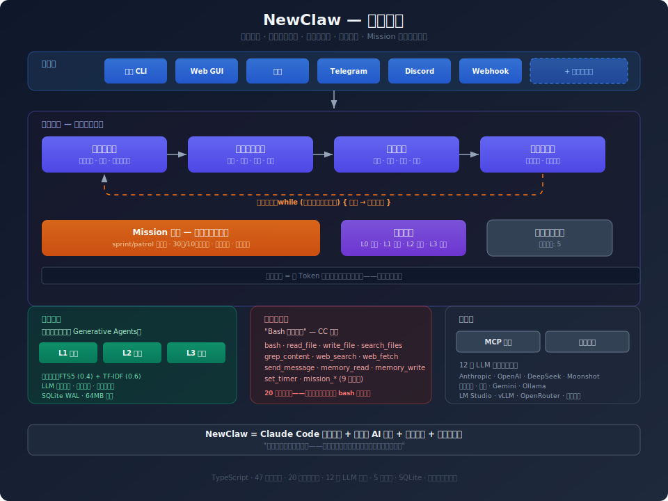
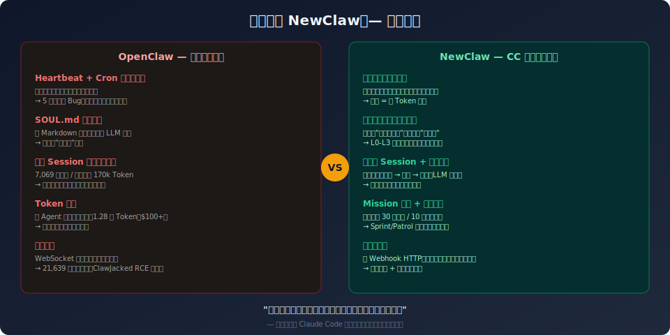
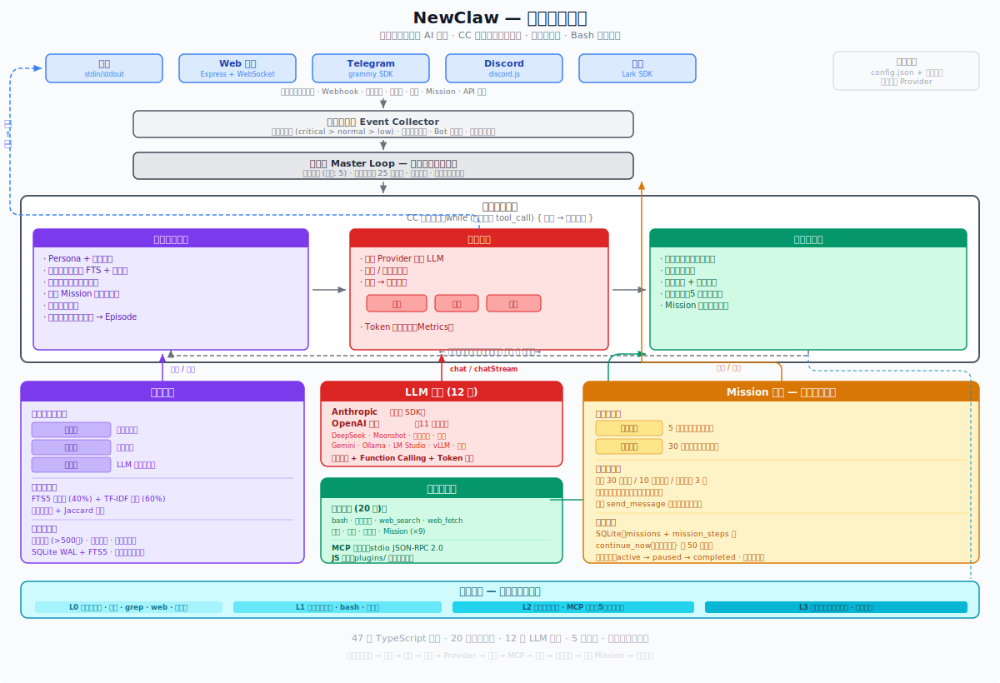

# NewClaw

**受 Claude Code 架构哲学启发的自主式 AI 伴侣框架**

[English](README.md) | **中文**

> *"Don't build for today's model, build for the model six months from now."*
> -- Ben Mann, Claude Code 项目管理者

> NewClaw = Claude Code 架构哲学（单循环 + 渐进式信任 + bash 万能）
>         + OpenClaw 产品定位（主动式 AI 伴侣 + 多平台）
>         + 事件驱动（替代 Heartbeat/Cron）
>         + 外部记忆服务（替代 Session 熵增）

**项目状态：早期实验阶段（v0.1）**

NewClaw 是一个个人学习项目，探索 Claude Code 的架构哲学能否应用于自主式 AI 伴侣场景。它**不是**一个生产级框架。请注意：

- 仅在单机单用户环境下测试过一个长期 Mission 任务，未经过大规模验证
- 部分设计文档中描述的能力做了务实降级（TF-IDF 替代向量数据库、字符串检测替代沙箱隔离等）
- "少约束"哲学依赖较强的底层模型，使用较弱模型时效果可能明显下降
- 由一个人作为业余项目开发和维护

欢迎贡献代码、反馈问题、参与讨论。如果你觉得这个设计方向有意思，一起探索。

<p align="center">
  
</p>

---

## 背景故事

### 灵感来源 -- CC vs Cursor 的胜负逆转

2025年，Cursor 以结构化规则、Diff 预览、上下文裁剪等工程化手段主导 AI 编程市场。然后 Claude Code 出现了——极简的单线程主循环 + bash 万能工具，无 IDE、无护栏。CC 创始人 Boris Cherny 的管理者 Ben Mann 说了一句奠定整个产品哲学的话：

> "Don't build for today's model, build for the model six months from now."

这在当时是高风险赌注。2025年2月 CC 发布时，模型能力（Claude 3.7 Sonnet）尚不足以支撑这种激进设计，Cursor 的体验远好于 CC。但 Claude 4（2025.5）和 Claude 4.5（2025.9）发布后，局势彻底逆转——2026年初开发者喜爱度 CC 46% vs Cursor 19%。

**核心发现：**

- **"Bash 就是一切"** -- 模型会自发用 bash 查 git 历史（工程师未预先设计），最朴素的 glob+grep 效果超过精心设计的 RAG 系统
- **渐进式信任** -- CC 团队随模型进步**删除**而非增加约束。模型能掌握的行为则删除约束；高风险操作则持续强化

### 问题 -- OpenClaw 的架构困境

OpenClaw（20万+ Star 开源 AI 伴侣框架）在实践中暴露了严重的工程问题：

- **Heartbeat + Cron 双调度系统**共享事件总线，导致 5 个已确认 Bug（路由歧义、状态互污染、回调去重缺失）
- **子 Agent 回调无限循环**消耗 1.28 亿 Token（$100+），无熔断机制
- **Session 持久化导致熵增死亡螺旋** -- 7,069 条消息 / 170k Token / 次心跳，越清理越膨胀
- **SOUL.md 文本约束**被模型"智能地"绕过，行为约束形同虚设
- **WebSocket 守护进程暴露公网** -- 21,639 个暴露实例（ClawJacked RCE 漏洞）

社区精确总结："90% 的时间花在工程问题上，不是 AI 问题上。"

### 解决方案 -- NewClaw 的设计公式

NewClaw 反其道而行：给模型环境和工具，让它自己决定做什么——就像 Claude Code 给了模型一个 bash，模型就自己学会了查 git 历史。

<p align="center">
  
</p>

---

## 五大设计原则

| # | 原则 | 说明 |
|---|------|------|
| 1 | **单循环零冲突** | 一个事件驱动主循环，替代双调度器。无轮询、无心跳——静默时零 Token 消耗。 |
| 2 | **渐进式信任** | 只约束"什么不能做"，不约束"怎么想"。L0-L3 四级权限随模型进步扩展。 |
| 3 | **Bash 就是一切** | 20 个核心工具 + bash 万能兜底。不为特定平台封装专用工具——模型用 `curl` 就行。 |
| 4 | **事件驱动非时间驱动** | 真实事件（Webhook、文件变更、消息）触发处理，不是固定时间表。 |
| 5 | **AI 提案人类决策** | 模型提出建议，人类审批高影响操作。安全边界只增不减。 |

---

## 快速开始

### 环境要求

- Node.js 18+
- 任意 LLM API Key（Anthropic、OpenAI、DeepSeek 或其他兼容厂商）

### 安装 & 运行

```bash
git clone https://github.com/xzl-it/NewClaw.git
cd NewClaw
npm install
```

编辑 `config.json`，填入 API Key：

```json
{
  "provider": "anthropic",
  "apiKey": "sk-ant-...",
  "model": "claude-sonnet-4-20250514"
}
```

或通过环境变量（自动检测厂商）：

```bash
export ANTHROPIC_API_KEY=sk-ant-xxx    # -> 自动选择 Anthropic
export DEEPSEEK_API_KEY=sk-xxx          # -> 自动选择 DeepSeek
```

启动：

```bash
npm run dev
```

```
╔══════════════════════════════════════╗
║          NewClaw v0.1.0              ║
║   Autonomous AI Companion            ║
╚══════════════════════════════════════╝
Commands: /quit  /memory  /status

You >
```

### config.json 完整参考

```json
{
  "provider": "anthropic",
  "apiKey": "",
  "baseUrl": "",
  "model": "claude-sonnet-4-20250514",
  "maxTokens": 65536,

  "persona": "你是 NewClaw，一个自主式 AI 伙伴...",
  "userProfile": "",

  "channels": [
    { "type": "terminal", "enabled": true },
    { "type": "web", "enabled": true, "options": { "port": 3210 } },
    { "type": "telegram", "enabled": false, "token": "" },
    { "type": "discord", "enabled": false, "token": "" },
    { "type": "feishu", "enabled": false, "options": { "appId": "", "appSecret": "" } }
  ],

  "memoryDbPath": "./data/memory.db",
  "webhookPort": 0,
  "quietHours": { "start": 23, "end": 8 },

  "permissions": {
    "approvalRequired": [],
    "forbidden": [],
    "autoApproveAll": false
  },

  "mcpServers": []
}
```

---

## 架构

NewClaw 的核心循环继承 Claude Code 的设计精髓：

```
CC 的核心：while (model produces tool_call) { execute; feed back }
```

扩展为自主伴侣：

```
while (alive) {
    event = await waitForEvent();       // 阻塞等待事件（零消耗）
    context = assemble(event);          // 身份 + 记忆 + 任务 + 工具（20-75k tokens）
    decision = model.reason(context);   // 行动 / 回复 / 沉默

    while (decision.hasToolCalls()) {   // CC 核心循环
        results = execute(decision);    // 并行执行 + 权限检查
        decision = model.reason(results);
    }
}
```

### 核心模块

| 模块 | 源文件 | 职责 |
|------|--------|------|
| **事件收集器** | `event-collector.ts` (179行) | 统一事件流、Webhook HTTP、文件监听、优先级队列、异步 `waitForEvent`/`wakeUp` |
| **上下文组装器** | `context-assembler.ts` (184行) | 每次请求组装身份+记忆+任务+工具、无持久 Session、多用户隔离（`historyMap`） |
| **模型推理** | `model-reasoning.ts` (144行) | 流式 LLM 交互、act/respond/silence 三种决策 |
| **行动执行器** | `action-executor.ts` (129行) | 并行工具执行 + 权限检查 |
| **权限边界** | `permission.ts` (100行) | L0 Free / L1 Notify / L2 Approve / L3 Forbidden |
| **Mission 引擎** | `runner.ts` (393行) + `store.ts` (357行) | 自主长期任务、sprint/patrol 模式、30轮/10分钟安全上限、自驱续跑、SQLite 持久化、重启恢复 |
| **异步任务队列** | `task-queue.ts` (91行) | 最大并发 5，后台处理长时间事件 |
| **日志 + 指标** | `logger.ts` + `metrics.ts` | 统一日志（Console + 文件）、Token/Event/ToolCall 统计 |

---

## 三层记忆系统

参考斯坦福 [Generative Agents](https://arxiv.org/abs/2304.03442) 论文：

| 层 | 内容 | 检索方式 |
|----|------|---------|
| **L1 事实** | 具体知识、偏好 | FTS5 关键词搜索 |
| **L2 情景** | 对话摘要、交互历史 | TF-IDF 向量相似度 |
| **L3 反思** | LLM 驱动的高阶洞见 | compact 时自动触发，失败降级为模板 |

**混合检索**：FTS5（权重 0.4）+ TF-IDF（权重 0.6）

**关键特性：**
- 多用户隔离（`user_id` 字段，搜索时合并用户专属 + 全局记忆）
- 自动摘要（对话窗口溢出时，丢弃的消息自动压缩为 episode）
- 自动 compact（记忆超 500 条时触发去重 + 合并）
- LLM 自省（compact 时自动触发反思，生成跨对话的高阶洞见）
- 模型自主管理（通过 `memory_read`/`memory_write` 工具决定记什么、忘什么）

---

## 四级权限边界

| 级别 | 区域 | 示例 | 行为 |
|------|------|------|------|
| **L0** | 自由区 | 读文件、搜索、读记忆、web_search、web_fetch | 自动执行 |
| **L1** | 通知区 | 写文件、bash、写记忆 | 执行后通知 |
| **L2** | 审批区 | send_message（发送外部消息） | 人类审批（5分钟超时） |
| **L3** | 禁止区 | 删除数据、暴露凭据 | 硬编码拒绝 |

L0/L1 随模型进步扩展。**L3 永不缩小。**

通过 `config.json` 的 `permissions` 配置自定义：
- `approvalRequired`：额外需要审批的工具列表
- `forbidden`：硬禁止的工具列表
- `autoApproveAll`：开发模式下跳过所有审批

---

## Mission 自主任务引擎

**最核心的差异化能力。** 传统 AI 是一问一答，Mission 让模型"给个目标，自主运转"。

### 工作流

```
用户："帮我监控 GitHub Issues，每天总结新增的"

模型：-> mission_create -> SQLite 持久化 -> 立即首次执行
     -> 每轮：组装上下文(目标+历史+策略+方法论)
             -> 模型自主推理(禁止问用户)
             -> 执行工具
             -> 记录 learning
             -> 调整 strategy
     -> 只在有意义的进展时通知用户
```

### 核心机制

| 机制 | 说明 |
|------|------|
| **Sprint/Patrol 双模式** | Sprint（5分钟间隔）用于紧急任务，Patrol（30分钟）用于日常巡逻 |
| **自驱续跑** | 模型可标记 `mission_continue_now` 立即续跑下一轮（不等间隔） |
| **安全限制** | 每轮最多 30 次循环或 10 分钟，以先到者为准 |
| **双重通知** | 系统级自动通知（每次 run 结束）+ 模型主动 `send_message` 汇报 |
| **持久化** | SQLite 存储，重启自动恢复所有 active 任务 |
| **自省机制** | 每 50 步提示模型评估进度，可自行暂停/降频 |
| **历史归档** | 超过 200 步自动归档旧步骤，防止无限膨胀 |

### 9 个 Mission 工具

| 工具 | 功能 |
|------|------|
| `mission_create` | 创建新任务，立即首次执行 |
| `mission_status` | 查看任务状态和最近步骤 |
| `mission_pause` | 暂停任务（清除定时器） |
| `mission_resume` | 恢复暂停的任务 |
| `mission_update_strategy` | 更新执行策略 |
| `mission_add_learning` | 记录学到的经验 |
| `mission_report` | 生成详细进度报告 |
| `mission_continue_now` | 标记立即续跑（跳过等待间隔） |
| `mission_set_interval` | 切换 Sprint/Patrol 模式 |

### 关于 Mission 调度机制的说明

坦诚讲：Mission 的调度底层是 `setTimeout` 链——一轮执行完后，`setTimeout(intervalMs)` 调度下一轮。这在机制上和 OpenClaw 的心跳有相似之处，都是定时触发。

核心区别不在"怎么触发"，而在"触发后做什么"：

| 维度 | OpenClaw 心跳 | NewClaw Mission |
|------|-------------|-----------------|
| 触发后执行内容 | 固定检查清单（HEARTBEAT.md） | 模型自主推理决定做什么 |
| 间隔由谁控制 | 硬编码配置 | 模型动态切换（sprint/patrol） |
| 上下文 | 在主 Session 中跑（170k token/次） | 独立 context，不污染主对话 |
| 空转消耗 | 每次心跳都跑完整推理 | 没有 Mission 时零消耗 |
| 自主控制 | 无 | 模型可自己续跑、暂停、调频 |

完全事件驱动的 Mission（由外部事件如 Webhook 触发而非定时器）是未来改进方向。

---

## 20 个核心工具

| 类别 | 工具 | 权限 |
|------|------|------|
| **Shell** | `bash` | L1 |
| **文件** | `read_file`, `write_file`, `search_files`, `grep_content` | L0/L1 |
| **网络** | `web_search`, `web_fetch` | L0 |
| **通信** | `send_message` | L2 |
| **记忆** | `memory_read`, `memory_write` | L0/L1 |
| **定时** | `set_timer` | L1 |
| **Mission** | 上述 9 个 `mission_*` 工具 | L1 |

**设计哲学**：不为特定平台封装专用工具。需要调 API？模型用 `bash` + `curl` 就行。20 个核心工具 + bash 万能兜底覆盖几乎所有场景。

---

## 12 个 LLM 厂商

从环境变量自动检测，零配置切换：

| 厂商 | 环境变量 | 默认模型 |
|------|---------|---------|
| Anthropic | `ANTHROPIC_API_KEY` | claude-sonnet-4-20250514 |
| OpenAI | `OPENAI_API_KEY` | gpt-4o |
| DeepSeek | `DEEPSEEK_API_KEY` | deepseek-chat |
| Moonshot/Kimi | `MOONSHOT_API_KEY` | kimi-latest |
| 通义千问 (Dashscope) | `DASHSCOPE_API_KEY` | qwen-plus |
| 智谱 GLM | `ZAI_API_KEY` | glm-4-plus |
| Google Gemini | `GEMINI_API_KEY` | gemini-2.5-flash |
| Ollama | *(无需 key)* | 本地模型 |
| LM Studio | *(无需 key)* | 本地模型 |
| vLLM | *(无需 key)* | 本地模型 |
| OpenRouter | `OPENROUTER_API_KEY` | 400+ 模型 |
| 硅基流动 (SiliconFlow) | `SILICONFLOW_API_KEY` | -- |

架构上分为两层：Anthropic 原生 SDK + OpenAI-Compatible 通用适配。任何实现 OpenAI Chat Completions API 的端点都可以通过 `baseUrl` 配置接入。

---

## 多通道

| 通道 | 技术 | 说明 |
|------|------|------|
| 终端 CLI | readline + ANSI 流式输出 | 内置，支持 `/quit` `/memory` `/status` 命令 |
| Web GUI | Express + WebSocket | 内置，暗色主题，默认端口 `localhost:3210` |
| 飞书 (Lark) | WSClient 长连接 | 富文本 + 卡片消息 |
| Telegram | grammy | Bot API |
| Discord | discord.js | Bot API |
| Webhook | HTTP POST | 接收外部事件（通过 `webhookPort` 配置） |

**所有通道可同时运行，共享记忆和上下文。** 你可以在飞书群里对话，同时在终端看到日志，Web GUI 实时查看状态。

---

## 扩展机制

### MCP 协议

支持 JSON-RPC 2.0 over stdio 的标准 MCP 协议。在 `config.json` 中声明即可自动发现并注册工具：

```json
{
  "mcpServers": [
    {
      "name": "filesystem",
      "command": "npx",
      "args": ["-y", "@anthropic/mcp-server-filesystem"]
    }
  ]
}
```

MCP 工具自动注册为 `mcp_{serverName}_{toolName}`，默认权限 L2（需审批）。

### 插件系统

在 `plugins/` 目录放入 `.js` 文件即可自动加载：

```javascript
// plugins/weather.js
export default {
  name: 'weather',
  description: 'Get weather for a city',
  parameters: { city: { type: 'string', description: 'City name', required: true } },
  permissionLevel: 0,
  execute: async ({ city }) => ({
    tool: 'weather', success: true,
    output: `Weather in ${city}: 25C, sunny`
  })
};
```

### 自定义通道

实现 `ChannelAdapter` 接口即可：`connect()`, `sendMessage()`, `onMessage()`, `disconnect()`。

---

## 项目结构

```
NewClaw/
├── config.json              # 配置（API 密钥、通道、权限）
├── data/                    # 运行时数据（SQLite 记忆库、日志）
├── plugins/                 # 插件目录（.js 自动加载）
├── docs/                    # 架构图
│   ├── architecture_cn.svg
│   └── design-philosophy_cn.svg
└── src/
    ├── index.ts             # 入口 -- 编排所有模块
    ├── types/               # 核心类型定义
    ├── config/              # 配置加载器 + 默认 persona
    ├── core/                # 引擎（10 个文件，含 index.ts 桶导出）
    │   ├── master-loop.ts       # 事件驱动主循环（313行）
    │   ├── event-collector.ts   # 事件队列 + Webhook + 文件监听（179行）
    │   ├── context-assembler.ts # 每次请求上下文组装（184行）
    │   ├── model-reasoning.ts   # 流式 LLM 交互（144行）
    │   ├── action-executor.ts   # 并行工具执行（129行）
    │   ├── permission.ts        # 四级权限边界（100行）
    │   ├── task-queue.ts        # 异步后台队列（91行）
    │   ├── logger.ts            # 统一日志
    │   └── metrics.ts           # 运行时指标
    ├── providers/           # LLM 适配层（Anthropic + 11 家 OpenAI 兼容）
    ├── memory/              # 三层记忆服务
    │   ├── schema.ts            # SQLite WAL + FTS5
    │   ├── embedding.ts         # TF-IDF 向量引擎
    │   ├── memory-service.ts    # CRUD + 混合检索 + 自动 compact
    │   └── reflection.ts        # LLM 驱动的自省
    ├── mission/             # 自主任务引擎
    │   ├── store.ts             # SQLite 持久化（357行）
    │   └── runner.ts            # 执行循环 sprint/patrol（393行）
    ├── channels/            # 通道适配器
    │   ├── terminal.ts          # 终端 CLI
    │   ├── web.ts               # Web GUI
    │   ├── feishu.ts            # 飞书
    │   ├── telegram.ts          # Telegram
    │   └── discord.ts           # Discord
    ├── tools/               # 最小工具集
    │   ├── bash.ts              # 万能 Shell 工具
    │   ├── file-ops.ts          # read/write/search/grep
    │   ├── web.ts               # web_search + web_fetch
    │   ├── message.ts           # 主动消息
    │   ├── memory-tool.ts       # 记忆读写
    │   ├── timer.ts             # 持久化定时器
    │   └── mission.ts           # 9 个 Mission 管理工具
    ├── mcp/                 # MCP 协议客户端
    └── plugins/             # 动态插件加载器
```

**47 个 TypeScript 源文件 · 20 个核心工具 · 12 个 LLM 厂商 · 5 个通道 · 零外部服务依赖**

### 完整架构图

<p align="center">
  
</p>

---

## 学术基础

| 模式 | 来源 | 在 NewClaw 中的应用 |
|------|------|-------------------|
| **ReAct** | Yao et al., ICLR 2023 | 核心推理-行动交替循环 |
| **Generative Agents** | Park et al., Stanford UIST 2023 | 三层记忆架构（事实 -> 情景 -> 反思） |
| **Reflexion** | Shinn et al., NeurIPS 2023 | LLM 驱动的反思记忆层 |
| **Voyager** | Wang et al., NVIDIA 2023 | Mission 引擎的技能积累与方法论迭代 |
| **Self-Refine** | Madaan et al., NeurIPS 2024 | 工具执行的迭代精炼 |
| **Event-Driven Agents** | Confluent 2025 | 事件收集器核心设计 |

---

## 与 OpenClaw 的核心区别

| 维度 | OpenClaw | NewClaw |
|------|---------|---------|
| **调度** | Heartbeat + Cron（5 个 Bug） | 单事件循环（零冲突） |
| **约束** | SOUL.md 文本约束（被绕过） | 四级权限边界（代码级强制） |
| **会话** | 持久 Session（熵增死亡螺旋） | 无 Session + 外部记忆服务 |
| **Token** | 心跳 170-210k/次 | 静默时零消耗 |
| **自主性** | Cron 触发（工程硬编码） | Mission 引擎（模型自主驱动） |
| **记忆** | Session 全量保存 | 三层记忆 + LLM 反思 + 自动 compact |
| **安全** | WebSocket 守护进程（21k 暴露） | Webhook-only HTTP |
| **多用户** | 共享 Session | 按 userId 隔离 |
| **厂商** | 手动配置 | 12 家自动检测 |

---

## 技术栈

- **运行时**：Node.js + TypeScript（ES2022, strict mode）
- **数据库**：SQLite WAL + FTS5（零外部服务）
- **LLM**：`@anthropic-ai/sdk` + `openai` SDK（12 厂商）
- **通道**：`@larksuiteoapi/node-sdk`、`grammy`、`discord.js`、`express`、`ws`
- **哲学**：单进程、本地优先、无 Redis、无消息队列、保持简单

---

## License

MIT

## 作者

**xzl** -- AI 应用工程师

专注：大模型架构、自主 Agent、AI 伴侣系统

- GitHub: [https://github.com/XZL-CODE](https://github.com/XZL-CODE)
- CSDN: [@逐梦苍穹](https://blog.csdn.net/weixin_43764974)
- 微信公众号：龙哥AI

<p align="center">
  
</p>

---

<p align="center">
  <i>"OpenClaw 试图用工程约束驯服模型的'过度智能'，结果工程本身成了最大的问题。NewClaw 反其道而行：给模型环境和工具，让它自己决定做什么。"</i>
</p>
